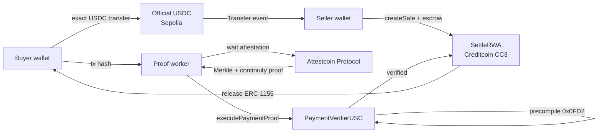

<p align="center">
  
</p>

<h1 align="center">Credo</h1>

<p align="center">
  <strong>Proof-triggered RWA settlement for Creditcoin.</strong><br/>
  Official USDC stays final on Ethereum. The ERC-1155 stays on Creditcoin.<br/>
  Only a cryptographic proof crosses chains — and the contract, not the backend, decides.
</p>

<p align="center">
  <a href="https://credo-settlement-rwa.vercel.app"></a>
  <a href="https://github.com/envexx/credo-settlement-rwa/stargazers"></a>
  <a href="https://github.com/envexx/credo-settlement-rwa/blob/main/LICENSE"></a>
  <a href="https://github.com/envexx/credo-settlement-rwa/commits/main"></a>
</p>

---

## Why Credo

```text
Buyer pays USDC on Sepolia  →  Attestcoin proves the payment  →  escrow releases the RWA on Creditcoin
```

Credo is a delivery-versus-payment **settlement layer**: any application — a marketplace, an OTC desk, an issuance platform — can escrow an ERC-1155 RWA on Creditcoin and release it against a verified USDC payment on Ethereum Sepolia. No bridge, no wrapped asset, no trusted intermediary.

| Conventional cross-chain RWA | Credo |
|---|---|
| USDC is bridged or wrapped | USDC **never leaves** Ethereum; the seller receives the real asset |
| An oracle or backend attests "payment happened" | The **Attestcoin Protocol** proves the exact Sepolia transaction; the Creditcoin contract verifies it synchronously |
| The operator can redirect or fake settlement | The worker has **zero settlement authority** — it can only carry evidence |
| Payment and release are loosely coupled | Release is bound to one buyer, one token, one recipient, one raw amount, one source block window, one-time use |

## How it works



1. **Seller** creates a sale on Creditcoin: the ERC-1155 enters SettleRWA escrow, bound to a private buyer and an exact payment tuple `(chainKey, token, buyer, recipient, amount)` valid only inside a Sepolia block window.
2. **Buyer** pays official USDC on Sepolia — a plain transfer, nothing else to sign.
3. **Worker** picks up the payment, waits for the source block to become attested (~8–10 minutes, a property of the protocol), fetches a Merkle inclusion + continuity proof via `@gluwa/usc-sdk`, and submits it on Creditcoin.
4. **PaymentVerifierUSC** verifies the proof through the native query verifier precompile `0x0000000000000000000000000000000000000FD2` *inside the settlement transaction*, decodes the receipt from the verified transaction bytes, and requires exactly one USDC `Transfer` matching every bound field.
5. **SettleRWA** releases the asset to the buyer and marks the query ID as consumed in the same transaction — replay is structurally impossible.

## Attestcoin Protocol integration

Credo's core scoring claim: the Attestcoin Protocol is not an add-on, it is the only path to settlement.

- **Synchronous on-chain verification.** `PaymentVerifierUSC.executePaymentProof` calls `INativeQueryVerifier.verifyAndEmit(...)` on precompile `0x…0FD2` inside the settlement transaction. If verification fails, the whole transaction reverts — no trusted off-chain assertion ever exists.
- **Receipt decoded from verified bytes.** The Sepolia receipt is decoded with the official `EvmV1Decoder` (`@gluwa/usc-contracts`) from the *verified* `encodedTransaction` — never from worker-supplied fields. Status, emitter, `topic1/topic2` addresses, and the raw amount are all extracted on-chain.
- **Exact-match policy.** Exactly one decoded log must match the bound token emitter, payer, recipient, and raw amount; zero or multiple matches both revert (`PaymentTransferNotFound` / `AmbiguousPaymentTransfer`).
- **chainKey ≠ chainId.** Attestcoin identifies Sepolia by chain key `1`, while the EVM chain ID is `11155111`. Both are configured and validated independently (`UnsupportedPaymentChain` otherwise).
- **Block window.** The payment is only valid while its source block height lies inside the sale's `[sourceStartBlock, sourceEndBlock]` window (≤ 50,000 blocks) — old payments can never be replayed into new sales.
- **Global replay guard.** `queryId = keccak(chainKey, blockHeight, txIndex)` is one-use across the entire protocol; the marker and the asset release share one transaction, so a failed release never burns the proof.
- **SDK in the worker.** The worker uses `@gluwa/usc-sdk` (`ProofBuilder`, `PrecompileChainInfoProvider`) to wait for attestation and fetch proofs against the official CC3 proof builder.

## Live testnet proof (v3 deployment)

Verified directly against CC3 RPC — not claimed, linked.

| Contract | Address |
|---|---|
| SettleRWA | [`0x643e070304b7ae9Eed815A7976AA83217206b64a`](https://creditcoin-testnet.blockscout.com/address/0x643e070304b7ae9Eed815A7976AA83217206b64a) |
| PaymentVerifierUSC | [`0x89df0af9C61D9636d1f67748D863f9AfC741EcfF`](https://creditcoin-testnet.blockscout.com/address/0x89df0af9C61D9636d1f67748D863f9AfC741EcfF) |
| TestRWA (demo asset) | [`0xEe1e1D277d011157dAC95F59189E9d5877668284`](https://creditcoin-testnet.blockscout.com/address/0xEe1e1D277d011157dAC95F59189E9d5877668284) |

A complete settlement with **two independent wallets** (distinct seller and buyer):

| Stage | Evidence |
|---|---|
| Buyer pays 5 USDC on Sepolia | [`0xfd25089e…f2383010`](https://sepolia.etherscan.io/tx/0xfd25089e189c53a5a39fc81eb0054e1069f66e3a761ddedeb64cd64df2383010) |
| Attestcoin proof accepted | queryId `0x4c94e8b1…d853e655`, latency **489 s** |
| Settlement on Creditcoin | [`0xcf9dd953…56eff96`](https://creditcoin-testnet.blockscout.com/tx/0xcf9dd953498e5378d4f815b997a6a1a44e8c03ee6a3ebf23f1c4b3c2956eff96) |
| Result | buyer ERC-1155 balance `1`, escrow `0`, replay marker `true` |

Raw artifacts live in [`docs/evidence/`](docs/evidence) and the full audit trail in [`docs/TDD-AUDIT.md`](docs/TDD-AUDIT.md).

## Repository layout

```text
contracts/src/          TestRWA.sol · SettleRWA.sol · PaymentVerifierUSC.sol
contracts/test/         Foundry suite (7 tests incl. 256-run fuzz invariants)
contracts/deployments/  Canonical deployment manifest (CC3 testnet)
src/app/api/v1/         Auth (SIWE-style) · sales prepare/index · payment · settlement status
src/lib/                Domain logic, strict Zod schemas, money math, security guards
worker/                 Persistent proof worker: validate → wait attestation → prove → submit → reconcile
db/                     PostgreSQL schema: sales index, payment attempts, proof jobs, audit log
docs/evidence/          On-chain evidence artifacts (before/after balances, tx records)
docs/INFRA-WORKPLAN.md  Builder-facing integration packaging plan
```

## Local development

```bash
npm install
npm run typecheck        # strict TypeScript, zero errors policy
npm test                 # 25 domain/worker/docs tests
npm run build            # production Next.js build

forge build              # contracts (Foundry; solc 0.8.30)
forge test -vvv          # 7 contract tests incl. fuzz
```

Database + worker (worker requires `DATABASE_URL`; see `.env.example`):

```bash
cp .env.example .env.local
npm run db:migrate
npm run worker           # long-running proof worker — never a serverless function
```

The full API contract, parameter reference, ABI downloads, and security model are documented in the in-app developer docs ([`/infra`](https://credo-settlement-rwa.vercel.app/infra)) and served by the app itself.

## Deployment sequence

1. Fund a dedicated CC3 deployer/worker wallet with tCTC (worker key holds no roles and no user funds).
2. Configure secrets in the deployment environment only — never in the repo, never in `NEXT_PUBLIC_*`.
3. `forge build && npm run contracts:deploy` — deploys the three contracts, binds the verifier once, registers chain key `1` / Sepolia `11155111` / official USDC / demo asset, and mints token `1001`.
4. Commit the generated manifest (`contracts/deployments/`) and record tx hashes in `docs/evidence/`.

## Security model

- **Checks-effects-interactions**, `ReentrancyGuard`, custom errors, non-upgradeable contracts.
- Admin can allowlist assets, register payment sources, and pause *new* sales — and **cannot** force-settle, redirect escrow, or mark a proof verified.
- Reclaim is only possible after the source window plus a 24-hour grace period, so a seller can never cancel after seeing the buyer pay.

**Honest limitation:** this is not an atomic two-chain swap. The Sepolia payment is irreversible before the Creditcoin release completes; the reclaim grace period is the mitigation until reverse write-back exists in the Attestcoin Protocol roadmap. The current deployment is testnet-only with curated asset onboarding.

---

<p align="center">
  <sub>Built for <strong>BUIDL CTC 2026 Fall — RWA Track</strong> · Creditcoin CC3 Testnet · Powered by the Attestcoin Protocol (USC v2)</sub>
</p>
