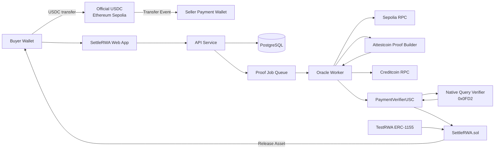
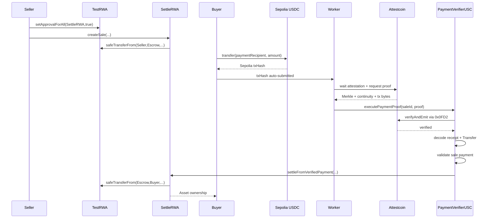

# SettleRWA — Technical Design Document (TDD) & Developer Playbook

**Document Type:** Technical Design Document / Engineering Playbook  
**Target:** BUIDL CTC 2026 Fall — RWA Track  
**Execution Network:** Creditcoin CC3 Testnet  
**Source Payment Network:** Ethereum Sepolia  
**Cross-chain Verification:** Attestcoin Protocol / Creditcoin USC v2  
**Status:** Implementation Specification  
**Version:** 1.0  
**Date:** 25 August 2026

---

# 1. RANGKUMAN TEKNIS & ARSITEKTUR SISTEM

## 1.1 Technical Objective

SettleRWA adalah **proof-triggered cross-chain RWA settlement protocol**.

Sistem menyelesaikan kondisi berikut:

```text
Buyer memiliki USDC
di Ethereum Sepolia

          +

Seller memiliki tokenized RWA
di Creditcoin

          ↓

Buyer membayar Seller
langsung di Sepolia

          ↓

Attestcoin membuktikan
pembayaran tersebut

          ↓

SettleRWA di Creditcoin
melepaskan RWA dari escrow

          ↓

Buyer menjadi pemilik RWA
```

Tidak ada:

- bridge USDC;
- wrapped USDC;
- pemindahan RWA ke Sepolia;
- centralized oracle yang menentukan apakah pembayaran benar;
- backend yang memiliki hak untuk memalsukan settlement;
- marketplace eksternal yang dibutuhkan untuk demo;
- penerbitan real-world Treasury sungguhan.

Komponen RWA testnet digunakan hanya untuk membuktikan **ownership transfer dan settlement mechanics**.

---

## 1.2 Core Technical Invariant

Invariant utama sistem:

```text
RWA MUST NOT leave escrow
unless a valid Attestcoin proof proves
the expected source-chain payment.
```

Secara formal:

```text
settle(saleId) = true
IFF

sourceChain == sale.paymentChain
AND
sourceTx successfully executed
AND
USDC contract == sale.paymentToken
AND
Transfer.from == sale.paymentPayer
AND
Transfer.to == sale.paymentRecipient
AND
Transfer.value == sale.paymentAmount
AND
sourceBlock ∈ sale.paymentWindow
AND
sale.status == OPEN
AND
sourceTransaction has never been consumed
```

Backend **tidak boleh menggantikan salah satu kondisi tersebut**.

---

## 1.3 Verified Protocol Baseline

Implementasi harus menggunakan **USC v2**, bukan arsitektur USC v1 lama.

USC v2 menggunakan native verifier precompile:

```text
0x0000000000000000000000000000000000000FD2
```

yang memverifikasi Merkle proof dan continuity proof secara sinkron di dalam transaksi Creditcoin. Precompile sendiri hanya membuktikan inclusion/continuity; contract aplikasi tetap wajib mengecek bahwa receipt source transaction sukses.

Repository contoh resmi Creditcoin saat ini menggunakan:

```text
@gluwa/usc-sdk        0.18.0
@gluwa/usc-contracts  0.1.2
ethers                6.17.x
Foundry               v1.2.3
```

sebagai baseline implementasi USC v2.

Current CC3 testnet integration pada contoh resmi menggunakan:

```text
Creditcoin RPC:
https://rpc.cc3-testnet.creditcoin.network

Creditcoin EVM Chain ID:
102031

Sepolia Attestcoin chainKey:
1
```

Contoh resmi juga menunjukkan attestation transaksi Sepolia baru biasanya membutuhkan sekitar **8–10 menit** sebelum proof tersedia; ini harus dianggap sebagai latency protokol, bukan bug aplikasi.

Untuk pembayaran demo gunakan **Circle USDC resmi di Ethereum Sepolia**:

```text
0x1c7D4B196Cb0C7B01d743Fbc6116a902379C7238
```

dengan 6 decimals.

---

# 1.4 Architectural Decisions / ADR

| ADR | Keputusan | Alasan |
|---|---|---|
| ADR-001 | Creditcoin menjadi execution/asset chain | Attestcoin verification dan RWA settlement terjadi native di sini |
| ADR-002 | Ethereum Sepolia menjadi payment/source chain | Didukung Attestcoin dan tersedia official test USDC |
| ADR-003 | USDC tidak di-bridge | Core value SettleRWA |
| ADR-004 | RWA tidak di-bridge | Ownership berpindah hanya di Creditcoin |
| ADR-005 | Gunakan existing USDC `Transfer` event | Buyer hanya melakukan pembayaran normal |
| ADR-006 | Tidak deploy payment contract di Sepolia pada MVP | Menghindari workflow/protocol baru di payment chain |
| ADR-007 | USC verifier dipisahkan dari settlement business logic | Security boundary lebih jelas dan mudah diaudit |
| ADR-008 | ERC-1155 sebagai demo RWA standard | Mendukung banyak asset ID dan quantity dalam satu contract |
| ADR-009 | Private sale intent, bukan open marketplace | Menghilangkan double-buyer/payment race |
| ADR-010 | On-chain state adalah source of truth | Database hanya indexing/automation |
| ADR-011 | Worker tidak dipercaya | Worker hanya membawa cryptographic proof ke contract |
| ADR-012 | Contract core non-upgradeable untuk hackathon | Mengurangi attack surface dan proxy complexity |
| ADR-013 | `chainKey` dan EVM `chainId` dianggap berbeda | Attestcoin menggunakan internal chain key |
| ADR-014 | Payment window menggunakan source block range | Lebih mudah diverifikasi daripada timestamp lintas chain |
| ADR-015 | MVP disebut proof-triggered settlement, bukan fully atomic cross-chain DvP | Payment → seller terjadi sebelum RWA release dan Attestcoin belum menyediakan reverse write path |

---

# 1.5 Penting: Penyimpangan dari Rekomendasi Attestcoin

Dokumentasi Creditcoin merekomendasikan event khusus dan menyarankan menghindari common event seperti ERC-20 `Transfer` untuk trigger cross-chain logic karena event khusus lebih tidak ambigu.

SettleRWA **sengaja menggunakan `Transfer` USDC standar** demi zero-additional-workflow UX.

Karena itu validation contract harus lebih ketat:

```text
chainKey
+
token contract
+
buyer
+
seller
+
exact amount
+
source block window
+
sale state
+
query replay guard
```

Selain itu, hanya **satu sale aktif dengan payment tuple identik** diperbolehkan.

---

# 1.6 Scope MVP

MVP mendukung:

```text
Payment:
Ethereum Sepolia
Official test USDC

Asset:
ERC-1155
Creditcoin CC3 Testnet

Sale:
1 seller
1 predefined buyer
1 payment
1 asset/token ID
1 settlement

Attestcoin:
single source transaction proof
```

Tidak termasuk MVP:

```text
open orderbook
auction
partial fills
multi-buyer sale
ERC-3643
KYC
real securities
mainnet capital
fiat
yield
pricing oracle
RWA issuance platform
cross-chain asset bridging
smart account abstraction
reverse Creditcoin → Ethereum messages
```

---

# 1.7 High-Level Component Architecture



---

# 1.8 Trust Boundaries

## Trusted by protocol

Only:

```text
Creditcoin consensus
Attestcoin attestation/verifier
deployed smart-contract bytecode
configured source token addresses
```

## Not trusted

```text
Frontend
Backend
Database
Worker
RPC provider
User-supplied tx hash
API status
Indexer
Browser
```

RPC/backend data boleh digunakan untuk UX dan discovery.

RPC/backend data **tidak boleh menentukan settlement**.

---

# 1.9 Smart Contract Architecture

Tiga contract utama:

```text
Creditcoin CC3 Testnet
│
├── TestRWA.sol
│     ERC-1155 demo RWA
│
├── SettleRWA.sol
│     sale
│     escrow
│     state machine
│     asset release
│
└── PaymentVerifierUSC.sol
      Attestcoin proof verification
      USDC event decoding
      payment matching
      replay prevention
```

Tidak ada contract baru di Sepolia.

Source contract adalah:

```text
Circle USDC
Ethereum Sepolia
0x1c7D...
```

---

# 1.10 Contract Interaction



---

# 1.11 Sale Lifecycle

```text
                 ┌─────────────┐
                 │   CREATED   │
                 │ asset escrow│
                 └──────┬──────┘
                        │
                        ▼
                      OPEN
                        │
              ┌─────────┴─────────┐
              │                   │
        valid proof           no payment
              │                   │
              ▼                   ▼
          SETTLED             RECLAIMABLE
                                  │
                                  ▼
                              RECLAIMED
```

Normal demo path:

```text
OPEN
 ↓
PAYMENT DETECTED
 ↓
WAITING ATTESTATION
 ↓
PROOF READY
 ↓
PROOF SUBMITTED
 ↓
VERIFIED
 ↓
SETTLED
```

Status payment setelah `OPEN` adalah off-chain observability states.

`SETTLED` hanya sah ketika tercatat di Creditcoin.

---

# 1.12 Database Philosophy

Database **bukan ledger**.

Database menyimpan:

```text
index
cache
worker state
job state
audit log
authentication
transaction discovery
```

Jika database dihapus seluruhnya, ownership RWA dan status settlement tetap dapat direkonstruksi dari blockchain.

---

# 1.13 Database Model

## `users`

| Field | Type | Constraint |
|---|---|---|
| `id` | UUID | PK |
| `wallet_address` | VARCHAR(42) | UNIQUE |
| `created_at` | TIMESTAMPTZ | NOT NULL |
| `last_login_at` | TIMESTAMPTZ | |

---

## `auth_nonces`

| Field | Type |
|---|---|
| `wallet_address` | VARCHAR(42) |
| `nonce_hash` | VARCHAR(128) |
| `expires_at` | TIMESTAMPTZ |
| `consumed_at` | TIMESTAMPTZ |

---

## `sales_index`

Mirrors Creditcoin `SaleCreated`.

| Field | Type |
|---|---|
| `sale_id` | VARCHAR(66) PK |
| `seller` | VARCHAR(42) |
| `buyer` | VARCHAR(42) |
| `asset_contract` | VARCHAR(42) |
| `token_id` | NUMERIC(78,0) |
| `asset_amount` | NUMERIC(78,0) |
| `payment_chain_key` | BIGINT |
| `payment_chain_id` | BIGINT |
| `payment_token` | VARCHAR(42) |
| `payment_recipient` | VARCHAR(42) |
| `payment_amount` | NUMERIC(78,0) |
| `source_start_block` | BIGINT |
| `source_end_block` | BIGINT |
| `status` | ENUM |
| `creation_tx_hash` | VARCHAR(66) |
| `created_at` | TIMESTAMPTZ |

Never use JavaScript `number` for:

```text
uint256
tokenId
token amount
USDC raw amount
block height if unsafe
```

Use:

```text
bigint
decimal string
NUMERIC(78,0)
```

---

## `payment_attempts`

| Field | Type |
|---|---|
| `id` | UUID PK |
| `sale_id` | VARCHAR(66) |
| `source_tx_hash` | VARCHAR(66) UNIQUE |
| `source_block` | BIGINT |
| `payer` | VARCHAR(42) |
| `recipient` | VARCHAR(42) |
| `token` | VARCHAR(42) |
| `amount_raw` | NUMERIC(78,0) |
| `status` | ENUM |
| `detected_at` | TIMESTAMPTZ |
| `last_error_code` | VARCHAR(64) |
| `last_error_message` | TEXT |

---

## `proof_jobs`

| Field | Type |
|---|---|
| `id` | UUID |
| `payment_attempt_id` | UUID UNIQUE |
| `chain_key` | BIGINT |
| `block_height` | BIGINT |
| `status` | ENUM |
| `attempt_count` | INT |
| `next_retry_at` | TIMESTAMPTZ |
| `creditcoin_tx_hash` | VARCHAR(66) |
| `query_id` | VARCHAR(66) |
| `created_at` | TIMESTAMPTZ |
| `updated_at` | TIMESTAMPTZ |

Do **not** persist raw private keys.

Proof blobs may optionally be persisted encrypted or object-stored for debugging, but are not required after successful settlement.

---

## `chain_cursors`

Digunakan untuk recovery/backfill.

```text
chain
contract
last_scanned_block
last_finalized_block
updated_at
```

---

## `audit_events`

Append-only operational log:

```text
PAYMENT_REGISTERED
PAYMENT_LOCALLY_VALIDATED
WAITING_ATTESTATION
PROOF_GENERATED
PROOF_SUBMITTED
PROOF_REJECTED
SALE_SETTLED
SALE_RECLAIMED
```

---

# 2. SPESIFIKASI TEKNIS & CONTRACTS

# 2.1 TestRWA.sol

Gunakan:

```solidity
ERC1155
AccessControl
```

Tujuan contract hanya menyediakan RWA testnet yang ownership-nya dapat diverifikasi.

Conceptual interface:

```solidity
interface ITestRWA {
    function mint(
        address to,
        uint256 tokenId,
        uint256 amount,
        bytes32 metadataHash
    ) external;

    function balanceOf(
        address account,
        uint256 id
    ) external view returns (uint256);
}
```

Roles:

```text
DEFAULT_ADMIN_ROLE
ISSUER_ROLE
```

Metadata demo wajib menyatakan:

```json
{
  "name": "Demo Treasury Note 2026-A",
  "assetId": "DTR-2026-001",
  "type": "TOKENIZED_TREASURY_DEMO",
  "faceValue": "5000 USD",
  "network": "Creditcoin CC3 Testnet",
  "testnet": true,
  "economicValue": false
}
```

---

# 2.2 SettleRWA.sol

## Core data structure

```solidity
enum SaleStatus {
    NONE,
    OPEN,
    SETTLED,
    RECLAIMED
}

struct Sale {
    address seller;
    address buyer;

    address assetContract;
    uint256 tokenId;
    uint256 assetAmount;

    uint64 paymentChainKey;
    uint64 paymentChainId;

    address paymentToken;
    address paymentRecipient;
    uint256 paymentAmount;

    uint64 sourceStartBlock;
    uint64 sourceEndBlock;

    SaleStatus status;
}
```

---

## Sale ID

```solidity
saleId = keccak256(
    abi.encode(
        block.chainid,
        address(this),
        seller,
        sellerNonce
    )
);
```

Never depend on database UUID as protocol identifier.

---

# 2.3 Payment Tuple

Untuk mengatasi generic ERC-20 `Transfer`, contract membangun tuple:

```solidity
bytes32 paymentTuple = keccak256(
    abi.encode(
        paymentChainKey,
        paymentToken,
        buyer,
        paymentRecipient,
        paymentAmount
    )
);
```

Rule:

```text
Only one OPEN sale may use an identical paymentTuple.
```

Storage:

```solidity
mapping(bytes32 => bytes32) public activeSaleForPaymentTuple;
```

Ini mencegah satu transfer ambigu terhadap dua sale identik.

---

# 2.4 `createSale`

Conceptual interface:

```solidity
function createSale(
    address buyer,
    address assetContract,
    uint256 tokenId,
    uint256 assetAmount,
    uint64 paymentChainKey,
    uint64 paymentChainId,
    address paymentToken,
    address paymentRecipient,
    uint256 paymentAmount,
    uint64 sourceStartBlock,
    uint64 sourceEndBlock
) external nonReentrant returns (bytes32 saleId);
```

Validations:

| Input | Validation |
|---|---|
| buyer | != zero |
| assetContract | approved asset |
| assetAmount | > 0 |
| paymentChainKey | supported |
| paymentChainId | matches configured chain |
| paymentToken | approved token |
| paymentRecipient | != zero |
| paymentAmount | > 0 |
| sourceStartBlock | > 0 |
| sourceEndBlock | > start |
| window | <= configured MAX_WINDOW |
| paymentTuple | no currently OPEN duplicate |

Flow:

```text
validate
↓
generate saleId
↓
write OPEN sale
↓
reserve payment tuple
↓
safeTransferFrom(
   seller,
   SettleRWA,
   tokenId,
   amount
)
↓
emit SaleCreated
```

---

# 2.5 `settleFromVerifiedPayment`

Only `PaymentVerifierUSC` may invoke.

```solidity
function settleFromVerifiedPayment(
    bytes32 saleId,
    bytes32 queryId,
    uint64 sourceBlock
) external onlyVerifier nonReentrant;
```

Checks:

```text
sale exists
sale OPEN
sourceBlock >= sourceStartBlock
sourceBlock <= sourceEndBlock
queryId != zero
```

Execution uses checks-effects-interactions:

```text
status = SETTLED
delete active payment tuple

↓ asset external call

safeTransferFrom(
    escrow,
    buyer,
    tokenId,
    amount
)
```

Emit:

```solidity
event SaleSettled(
    bytes32 indexed saleId,
    address indexed buyer,
    address indexed seller,
    bytes32 queryId,
    uint64 sourceBlock
);
```

---

# 2.6 PaymentVerifierUSC.sol

## Responsibility

Contract ini **tidak menyimpan asset**.

Responsibilities:

```text
Attestcoin proof verification
transaction replay prevention
receipt success verification
source chain authentication
USDC Transfer extraction
payment matching
call SettleRWA
```

---

## Native verifier

```solidity
INativeQueryVerifier constant VERIFIER =
    INativeQueryVerifier(
        0x0000000000000000000000000000000000000FD2
    );
```

Attestcoin USC v2 menyediakan `verify()` dan `verifyAndEmit()`; verification terjadi synchronously di transaksi yang sama.

---

## Main Entry Point

```solidity
function executePaymentProof(
    bytes32 saleId,
    uint64 chainKey,
    uint64 blockHeight,
    bytes calldata encodedTransaction,
    bytes32 merkleRoot,
    INativeQueryVerifier.MerkleProofEntry[] calldata siblings,
    bytes32 lowerEndpointDigest,
    bytes32[] calldata continuityRoots
) external returns (bool);
```

---

# 2.7 Payment Verification Algorithm

Pseudo-code:

```solidity
Sale memory sale = settlement.getSale(saleId);

require(sale.status == OPEN);
require(chainKey == sale.paymentChainKey);

uint64 txIndex = calculateTransactionIndex(siblings);

bytes32 queryId = keccak256(
    abi.encodePacked(
        chainKey,
        blockHeight,
        txIndex
    )
);

require(!processedQueries[queryId]);

verifyAttestcoinProof(...);

Receipt receipt =
    EvmV1Decoder.decodeReceiptFields(encodedTransaction);

require(receipt.receiptStatus == 1);

require(blockHeight >= sale.sourceStartBlock);
require(blockHeight <= sale.sourceEndBlock);

TransferMatch match =
    findExpectedPayment(
        receipt.logs,
        sale.paymentToken,
        sale.buyer,
        sale.paymentRecipient,
        sale.paymentAmount
    );

require(match.count == 1);

processedQueries[queryId] = true;

settlement.settleFromVerifiedPayment(
    saleId,
    queryId,
    blockHeight
);
```

---

# 2.8 ERC-20 Event Validation

Expected event signature:

```solidity
keccak256("Transfer(address,address,uint256)")
```

equals:

```text
0xddf252ad1be2c89b69c2b068fc378daa
952ba7f163c4a11628f55a4df523b3ef
```

For each receipt log:

```text
log.address == expected USDC contract
topic[0] == Transfer signature
topic[1] == buyer
topic[2] == seller/paymentRecipient
data == paymentAmount
```

Do **not** merely validate `topic0`.

Do **not** trust function calldata.

Do **not** trust backend-parsed events.

Do **not** trust worker-supplied payer/recipient/amount.

All values must be extracted from verified `encodedTransaction`.

Creditcoin's current USC examples explicitly demonstrate decoding receipt logs from verified transaction bytes using `EvmV1Decoder`.

---

# 2.9 Source Chain Authentication

Critical:

```text
Attestcoin chainKey != EVM chainId
```

For initial deployment:

```text
chainKey = 1
EVM chainId = 11155111
network = Sepolia
```

Do not write:

```solidity
require(chainKey == 11155111);
```

It is incorrect.

Configuration should use:

```solidity
struct SourceChainConfig {
    bool enabled;
    uint64 evmChainId;
}
```

```solidity
mapping(uint64 => SourceChainConfig)
    public sourceChains;
```

---

# 2.10 Replay Protection

Global replay identifier:

```text
queryId =
keccak256(
    chainKey,
    sourceBlockHeight,
    txIndex
)
```

Storage:

```solidity
mapping(bytes32 => bool)
    public processedQueries;
```

Processing order:

```text
1 verify proof
2 validate transaction
3 mark processed
4 execute settlement
```

Steps 3–4 berada dalam transaksi EVM yang sama.

Jika asset transfer gagal, transaksi revert sehingga:

```text
processedQueries[queryId]
```

juga kembali false.

---

# 2.11 Payment Block Window

Jangan menggunakan source timestamp untuk MVP.

Gunakan:

```text
sourceStartBlock
sourceEndBlock
```

Contoh:

```text
Sale created when Sepolia ≈ block 11,500,000

sourceStartBlock = 11,500,001
sourceEndBlock   = 11,507,201
```

Payment valid hanya jika proof menunjukkan:

```text
11,500,001 <= blockHeight <= 11,507,201
```

Keuntungan:

- old payment tidak dapat digunakan;
- deterministic;
- source proof memang membawa block height;
- tidak membutuhkan clock synchronization lintas chain.

---

# 2.12 Reclaim / Cancellation

Ini adalah risiko teknis paling besar di MVP.

Karena:

```text
USDC sudah berada di Seller
```

sebelum:

```text
RWA dilepas ke Buyer
```

maka seller **tidak boleh bisa segera cancel escrow** setelah melihat buyer membayar.

MVP policy:

```text
No immediate cancellation.
```

Seller hanya dapat reclaim setelah:

```text
source payment window expired
+
large proof grace period
```

Contoh testnet:

```text
reclaimDelay = 24 hours minimum
```

Namun ini **bukan cryptographically perfect cancellation mechanism**.

Production-grade atomic resolution membutuhkan salah satu:

```text
bidirectional verified messaging
source-chain payment escrow
write-to-source-chain Attestcoin capability
or another trustless refund primitive
```

Karena Attestcoin saat ini mempublikasikan Ethereum read/verify sebagai live capability dan cross-chain write sebagai roadmap, MVP tidak boleh mengklaim fully atomic two-way DvP.

---

# 2.13 Solidity Custom Errors

Gunakan custom errors daripada revert strings:

```solidity
error InvalidBuyer();
error InvalidSeller();
error InvalidAsset();
error UnsupportedPaymentChain();
error UnsupportedPaymentToken();
error InvalidPaymentAmount();
error InvalidPaymentWindow();
error DuplicatePaymentTuple();
error SaleNotOpen();
error PaymentOutsideWindow();
error QueryAlreadyProcessed();
error VerificationFailed();
error SourceTransactionFailed();
error PaymentTransferNotFound();
error AmbiguousPaymentTransfer();
error UnauthorizedVerifier();
error ReclaimNotAvailable();
```

---

# 2.14 Critical Contract Events

```solidity
event SaleCreated(...);

event AssetEscrowed(
    bytes32 indexed saleId,
    address indexed asset,
    uint256 tokenId,
    uint256 amount
);

event PaymentProofAccepted(
    bytes32 indexed saleId,
    bytes32 indexed queryId,
    uint64 chainKey,
    uint64 sourceBlock
);

event SaleSettled(...);

event AssetReclaimed(...);
```

Frontend/indexer harus mengikuti events ini.

---

# 2.15 API Architecture

Base:

```text
/api/v1
```

Transport:

```text
HTTPS
JSON
UTF-8
```

Schema validation:

```text
Zod
```

API tidak memiliki endpoint:

```text
POST /settle
```

yang bisa langsung mengubah ownership.

Settlement harus selalu terjadi melalui contract.

---

# 2.16 Authentication

Gunakan SIWE-style challenge:

```text
wallet
↓
request nonce
↓
sign message
↓
backend verifies
↓
short-lived session
```

Token/session disimpan:

```text
HttpOnly
Secure
SameSite=Lax
```

Jangan simpan JWT di:

```text
localStorage
sessionStorage
```

---

# 2.17 API — Auth Nonce

### `POST /v1/auth/nonce`

Request:

```json
{
  "walletAddress": "0xabc..."
}
```

Response `200`:

```json
{
  "nonce": "Vtu4o6gH...",
  "expiresAt": "2026-08-25T16:00:00Z"
}
```

Errors:

```text
400 INVALID_ADDRESS
429 RATE_LIMITED
```

---

# 2.18 API — Verify Signature

### `POST /v1/auth/verify`

```json
{
  "walletAddress": "0xabc...",
  "message": "...",
  "signature": "0x..."
}
```

Response:

```json
{
  "authenticated": true,
  "walletAddress": "0xAbC..."
}
```

Status:

```text
200 valid
401 invalid signature
409 nonce consumed
410 nonce expired
```

---

# 2.19 API — Prepare Sale

### `POST /v1/sales/prepare`

Seller authenticated.

Request:

```json
{
  "buyer": "0xBuyer",
  "assetContract": "0xRWA",
  "tokenId": "1001",
  "assetAmount": "1",
  "paymentNetwork": "sepolia",
  "paymentRecipient": "0xSeller",
  "paymentAmount": "5000.000000"
}
```

Backend:

```text
read seller asset balance
↓
resolve token decimals
↓
convert USDC to 6-decimal integer
↓
read current Sepolia block
↓
construct source block window
↓
validate no obvious duplicate
↓
return exact contract parameters
```

Response:

```json
{
  "contract": "0xSettleRWA",
  "method": "createSale",
  "params": {
    "buyer": "0xBuyer",
    "assetContract": "0xRWA",
    "tokenId": "1001",
    "assetAmount": "1",
    "paymentChainKey": "1",
    "paymentChainId": "11155111",
    "paymentToken": "0x1c7D4B196Cb0C7B01d743Fbc6116a902379C7238",
    "paymentRecipient": "0xSeller",
    "paymentAmount": "5000000000",
    "sourceStartBlock": "11500001",
    "sourceEndBlock": "11507201"
  }
}
```

This response is advisory.

Contract tetap melakukan validation.

---

# 2.20 API — Get Sale

### `GET /v1/sales/:saleId`

Response:

```json
{
  "saleId": "0x...",
  "status": "OPEN",
  "seller": "0x...",
  "buyer": "0x...",
  "asset": {
    "chainId": 102031,
    "contract": "0x...",
    "tokenId": "1001",
    "amount": "1"
  },
  "payment": {
    "chainId": 11155111,
    "chainKey": 1,
    "token": "0x1c7D...",
    "symbol": "USDC",
    "decimals": 6,
    "recipient": "0x...",
    "amountRaw": "5000000000",
    "amount": "5000.000000"
  },
  "sourceBlockWindow": {
    "start": "11500001",
    "end": "11507201"
  }
}
```

---

# 2.21 API — Payment Instruction

### `GET /v1/sales/:saleId/payment-instruction`

Response:

```json
{
  "chainId": 11155111,
  "token": "0x1c7D4B196Cb0C7B01d743Fbc6116a902379C7238",
  "method": "transfer",
  "recipient": "0xSeller",
  "amountRaw": "5000000000"
}
```

Frontend kemudian memanggil official USDC contract.

---

# 2.22 API — Submit Payment Transaction

Normal user **tidak mengetik tx hash**.

Frontend otomatis memperoleh hash dari wallet:

```typescript
const hash = await writeContract(...);
```

kemudian:

### `POST /v1/sales/:saleId/payment`

```json
{
  "sourceTxHash": "0x1234..."
}
```

Response `202`:

```json
{
  "paymentId": "0f75...",
  "status": "DETECTED",
  "sourceTxHash": "0x1234..."
}
```

Backend tidak mengatakan `VERIFIED` pada tahap ini.

---

# 2.23 Payment Status Endpoint

### `GET /v1/sales/:saleId/settlement`

Example:

```json
{
  "saleId": "0x...",
  "saleStatus": "OPEN",
  "payment": {
    "status": "WAITING_ATTESTATION",
    "sourceTxHash": "0x...",
    "sourceBlock": "11500291"
  },
  "proof": {
    "status": "WAITING_ATTESTATION"
  },
  "settlement": null
}
```

Setelah selesai:

```json
{
  "saleStatus": "SETTLED",
  "payment": {
    "status": "VERIFIED"
  },
  "proof": {
    "status": "ACCEPTED",
    "queryId": "0x..."
  },
  "settlement": {
    "creditcoinTxHash": "0x...",
    "assetRecipient": "0xBuyer",
    "tokenId": "1001"
  }
}
```

---

# 2.24 Payment Worker State Machine

```text
RECEIVED
   ↓
SOURCE_TX_PENDING
   ↓
SOURCE_TX_CONFIRMED
   ↓
LOCALLY_MATCHED
   ↓
WAITING_ATTESTATION
   ↓
GENERATING_PROOF
   ↓
PROOF_READY
   ↓
SUBMITTING
   ↓
SUBMITTED
   ↓
ONCHAIN_VERIFIED
   ↓
SETTLED
```

Failure states:

```text
RETRYABLE_ERROR
PERMANENT_REJECTION
```

---

# 2.25 Local Prevalidation Matrix

Local validation **tidak memberi authority**, tetapi menghindari gas/proof request sia-sia.

| Input | Worker validation | Contract validation |
|---|---:|---:|
| Source tx exists | ✓ | proof |
| Receipt success | ✓ | ✓ |
| Source block | ✓ | ✓ |
| Token address | ✓ | ✓ |
| Transfer sender | ✓ | ✓ |
| Transfer receiver | ✓ | ✓ |
| Amount | ✓ | ✓ |
| Sale OPEN | ✓ | ✓ |
| Proof inclusion | ✗ | ✓ |
| Continuity | ✗ | ✓ |
| Replay | local cache | ✓ |

---

# 2.26 Worker Algorithm

```typescript
async function processPayment(job: PaymentJob) {
  const sale = await readSaleFromCreditcoin(job.saleId);

  assert(sale.status === "OPEN");

  const receipt = await sepolia.getTransactionReceipt(job.txHash);

  validateReceiptLocally(receipt, sale);

  await waitUntilAttested({
    chainKey: sale.paymentChainKey,
    blockHeight: receipt.blockNumber,
  });

  const proof = await proofBuilder.getProof(job.txHash);

  const gasEstimate = await estimateSettlementGas(
    sale.saleId,
    proof
  );

  const tx = await paymentVerifier.executePaymentProof(
    sale.saleId,
    proof.chainKey,
    proof.headerNumber,
    proof.txBytes,
    proof.merkleProof.root,
    proof.merkleProof.siblings,
    proof.continuityProof.lowerEndpointDigest,
    proof.continuityProof.roots,
    {
      gasLimit: gasEstimate * 135n / 100n
    }
  );

  await tx.wait();

  await reconcileOnchainState(job.saleId);
}
```

Official USC examples use the same general model: worker waits until the source block has been attested, obtains proof through `@gluwa/usc-sdk`, then submits proof data to the USC.

---

# 2.27 Retry Policy

Retry only transient failure:

```text
RPC timeout
HTTP 429
proof not ready
attestation not ready
Creditcoin RPC temporarily unavailable
network timeout
```

Do not retry permanently:

```text
wrong buyer
wrong recipient
wrong token
wrong amount
failed source tx
source block outside payment window
sale already settled
query already processed
cryptographically invalid proof
```

Exponential strategy:

```text
15s
30s
60s
120s
300s
300s...
```

Attestation polling:

```text
15 seconds
```

Maximum automatic proof wait:

```text
20–30 minutes
```

Set job `RETRYABLE_ERROR` afterward rather than discarding.

---

# 2.28 Recovery Path

Jika browser ditutup setelah payment:

normal UX tidak boleh kehilangan transaksi.

Recovery mechanisms:

1. DB sudah menerima tx hash sebelum tab ditutup; atau
2. frontend reconnect menemukan pending tx; atau
3. user dapat menggunakan advanced recovery:

```text
Recover Payment
[ paste Sepolia transaction hash ]
```

Tx hash hanya locator.

Ia **bukan proof**.

USC tetap melakukan verification.

---

# 2.29 HTTP Error Contract

Standard:

```json
{
  "error": {
    "code": "PAYMENT_AMOUNT_MISMATCH",
    "message": "The source transfer does not match the sale amount.",
    "requestId": "req_8d..."
  }
}
```

Status:

| HTTP | Meaning |
|---:|---|
| 400 | Invalid schema |
| 401 | Not authenticated |
| 403 | Role/wallet mismatch |
| 404 | Sale/tx not found |
| 409 | State conflict |
| 410 | Sale no longer payable |
| 422 | Valid data, invalid payment semantics |
| 429 | Rate limited |
| 502 | RPC/proof dependency failure |
| 503 | Attestcoin/proof service unavailable |

---

# 2.30 Security Policy

## Smart contracts

Mandatory:

```text
ReentrancyGuard
Checks-Effects-Interactions
custom errors
immutable verifier address
strict chain allowlist
strict payment token allowlist
receipt status validation
log emitter validation
event signature validation
payer validation
recipient validation
exact amount validation
source block window
global replay protection
private-sale buyer binding
payment tuple uniqueness
```

---

## Admin privileges

Admin MAY:

```text
register supported asset contract
enable/disable creation of new sales
register payment source configuration
```

Admin MUST NOT be able to:

```text
fake payment
force-settle sale
change buyer after payment
withdraw RWA from active escrow
mark arbitrary proof verified
replace queryId
```

Emergency pause should ideally pause:

```text
new sale creation
```

without blocking settlement of already funded sales.

---

# 2.31 Worker Key Security

Worker key only needs tCTC gas.

Rules:

```text
dedicated wallet
minimal balance
no user funds
no admin role
no issuer role
no escrow authority
```

Production:

```text
AWS KMS / GCP KMS / HSM-backed signer
```

Hackathon:

```text
encrypted secret on deployment platform
```

Never:

```text
NEXT_PUBLIC_PRIVATE_KEY
GitHub repository
frontend env
Dockerfile
```

---

# 2.32 API Security

Use:

```text
SIWE signature auth
HttpOnly session
CSRF protection where applicable
strict CORS allowlist
Helmet/security headers
CSP
Zod validation
request body limits
per-IP rate limiting
per-wallet rate limiting
SQL parameterization
structured logging
secret redaction
```

CORS:

```text
https://settlerwa.app
https://staging.settlerwa.app
http://localhost:3000
```

Never:

```http
Access-Control-Allow-Origin: *
```

for authenticated endpoints.

---

# 2.33 RBAC

Roles:

```text
USER
OPERATOR
ADMIN
```

However ownership authorization berasal dari wallet/contract.

Backend `ADMIN` tidak berarti:

```text
smart-contract owner
```

Gunakan wallet admin on-chain terpisah.

---

# 3. PANDUAN IMPLEMENTASI DEVELOPER

# 3.1 Recommended Tech Stack

## Monorepo

```text
pnpm
Turborepo
TypeScript
```

## Frontend

```text
Next.js App Router
React
TypeScript strict
Tailwind CSS
shadcn/ui
wagmi
viem
TanStack Query
Zod
```

## API

```text
Node.js 22+
Hono or Fastify
TypeScript strict
Drizzle ORM
PostgreSQL
Zod
Pino logging
```

Recommendation: **Hono** jika tim ingin codebase ringan.

## Worker

```text
Node.js 22+
TypeScript
ethers v6
@gluwa/usc-sdk
@gluwa/usc-contracts
PostgreSQL-backed job queue
```

Untuk MVP gunakan:

```text
pg-boss
```

agar tidak membutuhkan Redis tambahan.

## Contracts

```text
Solidity ^0.8.30
Foundry
OpenZeppelin Contracts 5.x
@gluwa/usc-contracts
```

## Database

```text
PostgreSQL 16+
```

## Hosting — Hackathon

```text
Web       → Vercel
API       → Railway / Fly.io
Worker    → Railway / Fly.io
Database  → Neon / managed PostgreSQL
```

Worker **jangan** ditempatkan pada serverless function yang memiliki execution timeout pendek.

---

# 3.2 Recommended Folder Structure

```text
settlerwa/
│
├── apps/
│   ├── web/
│   │   ├── app/
│   │   ├── components/
│   │   ├── features/
│   │   │   ├── wallet/
│   │   │   ├── assets/
│   │   │   ├── sales/
│   │   │   ├── payment/
│   │   │   └── settlement/
│   │   └── lib/
│   │
│   ├── api/
│   │   └── src/
│   │       ├── modules/
│   │       │   ├── auth/
│   │       │   ├── sales/
│   │       │   ├── payments/
│   │       │   └── settlements/
│   │       ├── middleware/
│   │       └── infrastructure/
│   │
│   └── worker/
│       └── src/
│           ├── jobs/
│           ├── attestcoin/
│           ├── creditcoin/
│           ├── sepolia/
│           ├── retry/
│           └── reconciliation/
│
├── packages/
│   ├── contracts/
│   │   ├── src/
│   │   │   ├── TestRWA.sol
│   │   │   ├── SettleRWA.sol
│   │   │   └── PaymentVerifierUSC.sol
│   │   ├── test/
│   │   ├── script/
│   │   └── deployments/
│   │
│   ├── chain-config/
│   ├── db/
│   ├── shared/
│   ├── validation/
│   └── contract-abis/
│
├── docs/
│   ├── architecture/
│   ├── threat-model/
│   ├── evidence/
│   └── demo/
│
├── docker/
├── .github/
│   └── workflows/
├── pnpm-workspace.yaml
└── turbo.json
```

---

# 3.3 `.env.example`

```bash
# APP
NODE_ENV=development
APP_URL=http://localhost:3000
API_URL=http://localhost:4000

# DATABASE
DATABASE_URL=postgresql://...

# CREDITCOIN
CREDITCOIN_RPC_URL=https://rpc.cc3-testnet.creditcoin.network
CREDITCOIN_CHAIN_ID=102031
CREDITCOIN_EXPLORER=https://creditcoin-testnet.blockscout.com

# ATTESTCOIN
CREDITCOIN_PROOF_BUILDER_URL=https://prover.cc3-testnet.creditcoin.network/
SEPOLIA_ATTESTCOIN_CHAIN_KEY=1

# SEPOLIA
SEPOLIA_RPC_URL=https://...
SEPOLIA_CHAIN_ID=11155111
SEPOLIA_USDC_ADDRESS=0x1c7D4B196Cb0C7B01d743Fbc6116a902379C7238

# DEPLOYMENTS
TEST_RWA_ADDRESS=0x...
SETTLE_RWA_ADDRESS=0x...
PAYMENT_VERIFIER_USC_ADDRESS=0x...

# SERVER SIGNING / AUTH
SESSION_SECRET=...
SIWE_DOMAIN=localhost

# WORKER ONLY
CREDITCOIN_WORKER_PRIVATE_KEY=0x...

# OBSERVABILITY
SENTRY_DSN=
LOG_LEVEL=info
```

Never commit real `.env`.

---

# 3.4 Local Prerequisites

Required:

```text
Node.js 22+
pnpm
Git
Docker
Foundry
PostgreSQL
MetaMask/Rabby
Sepolia ETH
tCTC
Sepolia test USDC
```

Foundry baseline dari repository USC resmi menggunakan v1.2.3.

---

# 3.5 Local Bootstrap

```bash
git clone <repo>
cd settlerwa

pnpm install

cp .env.example .env

docker compose up -d postgres

pnpm db:migrate
pnpm db:seed

forge install
forge build
forge test

pnpm dev
```

Run services:

```bash
pnpm --filter web dev
pnpm --filter api dev
pnpm --filter worker dev
```

---

# 3.6 Contract Deployment Sequence

Deploy in this order:

```text
1 TestRWA
2 SettleRWA
3 PaymentVerifierUSC
4 SettleRWA.setVerifier(PaymentVerifierUSC)
5 configure Sepolia source
6 whitelist official Sepolia USDC
7 register TestRWA
8 mint demo asset to Seller
```

Save deployment manifest:

```json
{
  "network": "creditcoin-cc3-testnet",
  "chainId": 102031,
  "contracts": {
    "TestRWA": "0x...",
    "SettleRWA": "0x...",
    "PaymentVerifierUSC": "0x..."
  },
  "source": {
    "chainKey": 1,
    "chainId": 11155111,
    "usdc": "0x1c7D4B196Cb0C7B01d743Fbc6116a902379C7238"
  }
}
```

Commit deployment manifest.

Never commit deployer key.

---

# 3.7 Demo Seeding

Create:

```text
Seller wallet
Buyer wallet
```

Mint:

```text
Token ID: 1001
Quantity: 1
Owner: Seller
```

Verify before demo:

```solidity
balanceOf(seller, 1001) == 1
balanceOf(buyer, 1001) == 0
```

Buyer:

```text
Sepolia USDC > demo price
Sepolia ETH > gas
```

Worker:

```text
tCTC > sufficient gas
```

---

# 3.8 Coding Standards — TypeScript

`tsconfig`:

```json
{
  "compilerOptions": {
    "strict": true,
    "noUncheckedIndexedAccess": true,
    "exactOptionalPropertyTypes": true,
    "noImplicitOverride": true,
    "noFallthroughCasesInSwitch": true
  }
}
```

Rules:

```text
no `any`
no floating-point token amounts
addresses validated before use
BigInt at chain boundary
Zod at API boundary
Result/Error types for recoverable failures
```

Money:

Bad:

```typescript
const amount = 5000.1 * 1e6;
```

Good:

```typescript
const amount = parseUnits("5000.1", 6);
```

---

# 3.9 Solidity Conventions

Use:

```text
NatSpec on external/public functions
custom errors
immutable variables where possible
events for state transitions
private helper methods
named constants
checks-effects-interactions
```

Avoid:

```text
tx.origin
delegatecall
arbitrary external call
unbounded storage loops
dynamic contract execution
```

---

# 3.10 Git Strategy

Use trunk-based development.

Branches:

```text
main
feat/<name>
fix/<name>
chore/<name>
security/<name>
```

Examples:

```text
feat/payment-proof-decoder
feat/sale-escrow
fix/replay-guard
security/source-chain-validation
```

PR required before `main`.

---

# 3.11 Commit Convention

Conventional Commits:

```text
feat(contracts): add payment proof validation
feat(worker): wait for attestcoin checkpoint
fix(usc): reject failed source receipts
test(contracts): add payment replay invariant
docs(architecture): document source chain trust boundary
```

---

# 3.12 Pull Request Requirements

Every PR must pass:

```text
format
lint
typecheck
unit tests
contract tests
build
security checks
```

Security-sensitive contract PR requires:

```text
second reviewer
```

Mandatory when modifying:

```text
proof verification
event decoder
replay guard
access control
asset release
payment matching
```

---

# 3.13 Test Strategy

## Solidity unit tests

Minimum:

```text
create sale success
invalid buyer
unsupported token
invalid source chain
escrow transfer
payment tuple duplicate
correct proof
wrong source chain
wrong token emitter
wrong payer
wrong recipient
wrong amount
failed receipt
payment outside block window
replay
sale already settled
non-verifier settle attempt
reentrancy
reclaim delay
```

---

## Fuzz tests

Example:

```solidity
function testFuzz_CannotSettleWrongAmount(
    uint256 badAmount
) public {
    vm.assume(badAmount != expectedAmount);
    ...
}
```

Fuzz:

```text
amount
tokenId
source block
buyer
recipient
event ordering
multiple receipt logs
```

---

## Invariants

Critical:

```text
INV-001:
An OPEN sale holds the configured RWA quantity.

INV-002:
A SETTLED sale cannot become OPEN again.

INV-003:
One queryId can settle at most one sale.

INV-004:
A sale can settle at most once.

INV-005:
Only expected buyer can receive escrowed asset.

INV-006:
A proof with mismatched USDC data cannot release asset.

INV-007:
Worker identity cannot affect payment validity.

INV-008:
Total demo RWA supply remains unchanged during settlement.
```

---

# 3.14 Proof Testing Strategy

Do not call live Attestcoin for every unit test.

Use three layers.

### Layer A — Mocked precompile

At Foundry test level:

```text
mock 0x0FD2
```

to test application logic.

### Layer B — Captured valid proof fixture

Store sanitized proof fixtures from a real Sepolia transaction.

Use for deterministic integration tests.

### Layer C — Live testnet smoke

Run against:

```text
real Sepolia
real Attestcoin
real CC3 Testnet
```

before submission.

---

# 3.15 Negative Live Tests

Capture explorer evidence for:

```text
correct payment → succeeds
wrong amount → rejected
wrong recipient → rejected
same proof twice → rejected
failed source tx → rejected
wrong sale → rejected
```

These are extremely valuable because they prove Attestcoin integration is not decorative.

---

# 3.16 CI Pipeline

GitHub Actions:

```text
install
↓
format check
↓
eslint
↓
tsc
↓
unit tests
↓
forge fmt --check
↓
forge build
↓
forge test
↓
forge fuzz/invariants
↓
Slither
↓
frontend build
↓
Docker build
```

Recommended workflow names:

```text
ci.yml
contracts.yml
security.yml
deploy-staging.yml
live-testnet-smoke.yml
```

---

# 3.17 CD Pipeline

## Staging

Merge `main`:

```text
deploy API
deploy worker
migrate database
deploy web
smoke health endpoints
read contract deployment manifest
```

Contract deployment **tidak otomatis setiap commit**.

Gunakan protected manual workflow:

```text
workflow_dispatch
```

---

# 3.18 Production Readiness Gate

Sebelum tag:

```text
v1.0.0
```

harus lolos:

```text
all contract tests
all E2E tests
real Attestcoin settlement
negative proof tests
deployment manifest committed
contract source verified
no high/critical Slither issue
no hardcoded secret
database migration tested
recovery workflow tested
worker restart tested
RPC failover tested
```

---

# 3.19 Observability

Structured logs:

```json
{
  "level": "info",
  "service": "proof-worker",
  "saleId": "0x...",
  "sourceTxHash": "0x...",
  "sourceBlock": 11500291,
  "stage": "WAITING_ATTESTATION",
  "attempt": 4
}
```

Never log:

```text
private keys
JWT
session cookie
full auth signatures unnecessarily
database credentials
```

---

# 3.20 Required Demo Evidence Folder

```text
docs/evidence/
│
├── contracts/
│   ├── addresses.json
│   └── deployment-txs.md
│
├── rwa/
│   ├── before.json
│   └── after.json
│
├── payment/
│   └── sepolia-tx.json
│
├── attestcoin/
│   └── proof-run.json
│
└── settlement/
    └── creditcoin-tx.json
```

`before.json`:

```json
{
  "sellerBalance": "1",
  "buyerBalance": "0"
}
```

`after.json`:

```json
{
  "sellerBalance": "0",
  "buyerBalance": "1"
}
```

---

# 4. METRIK KEBERHASILAN & KPI TEKNIS

# 4.1 API Performance

| Metric | Target |
|---|---:|
| GET API p50 | < 80 ms |
| GET API p95 | < 200 ms |
| GET API p99 | < 500 ms |
| write API p95 excluding blockchain | < 300 ms |
| API error rate | < 1% |
| staging uptime | ≥ 99.5% |
| production target | ≥ 99.9% |

Blockchain RPC latency excluded dari pure API SLO tetapi diukur terpisah.

---

# 4.2 Cross-Chain Settlement Latency

Jangan menetapkan:

```text
<5 seconds
```

karena itu tidak realistis.

Official USC example mencatat transaksi Sepolia baru memerlukan sekitar 8–10 menit untuk menjadi attestable.

Target:

| Stage | Target |
|---|---:|
| Detect Sepolia receipt | < 15 s after mined |
| Worker poll interval | 15 s |
| Attestation readiness | protocol dependent |
| Proof fetch after ready | < 30 s p95 |
| Creditcoin submit after proof | < 15 s |
| Final settlement after proof ready | < 60 s |
| Total Sepolia → settlement testnet target | ≤ 12 min p95 under normal protocol conditions |

UI harus menunjukkan:

```text
Payment confirmed
Waiting for cross-chain attestation
```

bukan spinner tanpa konteks selama 10 menit.

---

# 4.3 Worker Reliability

| Metric | Target |
|---|---:|
| Accepted job loss | 0 |
| Duplicate settlement | 0 |
| Replay acceptance | 0 |
| Automatic transient retry | 100% |
| Job recovery after restart | < 60 s |
| Proof-ready → submission | < 30 s p95 |
| permanent error falsely retried | 0 |

---

# 4.4 Contract Quality

Targets:

```text
statement coverage ≥ 90%
branch coverage ≥ 85%
critical settlement paths = 100%
critical security conditions = explicit tests
```

Minimum fuzz runs CI:

```text
256 per fuzz test
```

Release:

```text
10,000+ selected critical fuzz cases
```

---

# 4.5 Application Test Coverage

| Component | Minimum |
|---|---:|
| Shared library | 90% |
| Payment matching | 95% |
| Worker | 85% |
| API | 80% |
| Frontend utility logic | 75% |
| Critical E2E | 100% core flow |

Do not chase UI snapshot coverage merely to increase numbers.

---

# 4.6 Build Quality

Targets:

```text
TypeScript errors = 0
ESLint warnings = 0 in CI
Solidity compiler warnings reviewed
critical dependency vulnerabilities = 0
high dependency vulnerabilities = 0 before release
```

Target build times:

```text
web < 3 min
API < 2 min
contract CI < 3 min
full CI < 10 min
```

---

# 4.7 Reliability SLIs

Monitor:

```text
RPC availability
proof builder availability
latest Attestcoin height
attestation lag
pending proof jobs
oldest pending job
Creditcoin worker wallet balance
failed settlement count
replay rejection count
payment mismatch count
```

Critical alerts:

```text
attestation height not advancing
oldest pending job > 20 min
worker balance below threshold
>5 consecutive proof service failures
settlement transaction repeated revert
```

---

# 4.8 Error Budget

Target production:

```text
successful API availability 99.9%
```

Worker target:

```text
99% of valid proof-ready jobs submitted within 60 sec
```

Attestcoin network latency/outage harus dicatat sebagai dependency metric terpisah.

---

# 4.9 MTTR

| Incident | Target |
|---|---:|
| Web/API restart | < 10 min |
| Worker stuck | < 15 min |
| RPC provider issue | < 10 min via failover |
| DB migration rollback | < 30 min |
| contract vulnerability | emergency new-sale pause immediately |

Smart-contract incident tidak selalu dapat "fixed in place" karena MVP contract non-upgradeable.

Gunakan versioned replacement deployment.

---

# 5. TECHNICAL DEBT, RISIKO & ROADMAP EKSEKUSI

# 5.1 Risk Register

| Risk | Severity | Mitigation |
|---|---:|---|
| Generic USDC `Transfer` ambiguity | High | exact tuple + private buyer + source block range + tuple uniqueness |
| Payment irreversible before RWA settlement | Critical | asset escrow first, long reclaim grace, automatic proof worker |
| Attestcoin outage/lag | High | persistent queue, retry, recovery |
| Worker compromised | Medium | worker has no settlement authority; contract verifies proof |
| Source RPC lies | Low/Medium | only discovery; cryptographic proof authoritative |
| Wrong chainKey | Critical | strict configured source chain |
| Replayed source transaction | Critical | global query replay guard |
| Fake ERC20 emits Transfer | Critical | token emitter allowlist |
| Failed Sepolia transaction included | Critical | verify receipt status |
| Seller cancels after payment | Critical | no immediate cancellation |
| Duplicate identical active sale | High | payment tuple reservation |
| Frontend database lies | Low | UI cross-checks contract |
| RWA metadata changed | Medium | metadata hash |
| Contract admin compromise | High | minimal admin powers + multisig later |
| Proof library update breaks decoding | High | pinned dependencies + captured fixtures |
| Testnet reset | Medium | deployment manifests + redeploy scripts |

---

# 5.2 Fundamental Atomicity Limitation

Current flow:

```text
1 RWA enters escrow
2 Buyer pays Seller
3 Attestcoin proves payment
4 RWA released
```

Step 2 dan 4 tidak berada pada transaksi blockchain yang sama.

Therefore:

```text
SettleRWA MVP is not a mathematically atomic
two-chain asset swap.
```

It is:

> **trustless proof-triggered asset settlement after an irreversible source-chain payment.**

Marketing dan documentation tidak boleh mengklaim sebaliknya.

Future version dapat mencapai proper two-way settlement ketika reliable reverse messaging/write capability tersedia atau ketika source payment leg memiliki trustless escrow mechanism.

---

# 5.3 Technical Debt — Standard Transfer

Menggunakan Circle USDC langsung adalah keuntungan UX terbesar sekaligus technical compromise terbesar.

Future optional mode:

```text
PaymentIntentRouter
```

yang bisa emit:

```solidity
event RWAPayment(
    bytes32 indexed saleId,
    address indexed buyer,
    address indexed seller,
    address token,
    uint256 amount
);
```

Buyer masih hanya melakukan satu click.

Tetapi MVP sengaja tidak menggunakan contract ini agar dapat membuktikan:

> existing payment rail dapat dipakai tanpa protocol-specific integration.

---

# 5.4 Technical Debt — Demo RWA

`TestRWA.sol` bukan production RWA issuer.

Future adapters:

```text
ERC-20 RWA
ERC-721 RWA
ERC-1155 RWA
ERC-3643 regulated asset
```

Gunakan adapter interface:

```solidity
interface IAssetAdapter {
    function escrow(
        address from,
        uint256 tokenId,
        uint256 amount
    ) external;

    function release(
        address to,
        uint256 tokenId,
        uint256 amount
    ) external;
}
```

Tidak wajib di MVP.

---

# 5.5 Technical Debt — Open Marketplace

MVP hanya:

```text
Seller → specific Buyer
```

Karena open listing memiliki race:

```text
Buyer A pays
Buyer B pays
only one RWA exists
```

Jangan implementasikan open marketplace sebelum reservation protocol tersedia.

Future:

```text
listing
↓
buyer reserves
↓
unique payment intent
↓
payment
↓
settlement
```

---

# 5.6 Technical Debt — Smart Accounts

MVP mengasumsikan standard EVM wallet/address semantics.

Account abstraction dapat menghasilkan transaksi di mana:

```text
tx.from != token holder
```

Payment validation harus berfokus pada verified USDC `Transfer.from`, bukan hanya outer transaction sender.

Smart-account support memerlukan dedicated integration tests.

---

# 5.7 Technical Debt — Compliance

Real RWA dapat memiliki:

```text
transfer restrictions
KYC
whitelist
lockup
jurisdiction
investor qualification
```

SettleRWA core tidak boleh bypass restriction issuer.

Jika RWA transfer revert karena compliance:

```text
settlement transaction must revert
```

dan proof query tidak boleh dianggap consumed secara irreversible.

Ini sebabnya replay marker dan transfer terjadi dalam transaction context yang sama.

---

# 5.8 Execution Roadmap

## Phase 0 — Protocol Spike

Tasks:

```text
verify CC3 RPC
verify Sepolia chainKey
query ChainInfo
test 0x0FD2
install USC SDK
generate one real Sepolia proof
submit Hello Bridge-style proof
record latency
```

Exit criteria:

```text
real Attestcoin proof succeeds
```

Jangan mulai UI sebelum ini berhasil.

---

## Phase 1 — RWA Foundation

Build:

```text
TestRWA.sol
mint script
metadata
Foundry tests
deployment script
```

Exit:

```text
Seller owns token #1001
Buyer owns 0
visible on Creditcoin
```

---

## Phase 2 — Settlement Escrow

Build:

```text
SettleRWA.sol
Sale struct
private buyer
asset escrow
payment tuple
source block window
events
reclaim logic
tests
```

Exit:

```text
RWA is truly held by SettleRWA contract
```

---

## Phase 3 — Attestcoin Payment Verifier

Build:

```text
PaymentVerifierUSC.sol
Native Query Verifier interface
EvmV1Decoder integration
source-chain validation
receipt validation
USDC log matching
replay guard
SettleRWA authorization
```

Negative tests mandatory.

Exit:

```text
valid proof releases RWA
invalid proof cannot release RWA
```

---

## Phase 4 — Real Cross-Chain Proof

Use actual:

```text
Circle Sepolia USDC
```

Steps:

```text
Seller creates sale
Buyer sends test USDC
capture tx
wait attestation
generate proof
submit proof
verify Buyer RWA balance
```

Exit:

```text
seller Sepolia USDC increased
buyer Creditcoin RWA increased
all hashes public
```

This is the most important engineering gate.

---

## Phase 5 — Worker Automation

Build:

```text
payment job
receipt reader
local validator
attestation polling
proof generation
Creditcoin submit
persistent retry
reconciliation
worker recovery
```

Exit:

```text
Buyer only signs USDC transfer.
Everything after it is automatic.
```

---

## Phase 6 — Backend

Build:

```text
SIWE
sale indexer
payment API
proof status
settlement status
database
audit log
health checks
```

Exit:

```text
frontend never needs proof internals
```

---

## Phase 7 — Frontend

Essential screens:

```text
Connect Wallet

Seller:
Create Sale
Sale Created
Share Sale Link

Buyer:
Sale Details
Pay USDC
Waiting for Attestation
Payment Verified
Asset Settled

Portfolio:
My RWA
```

UI must show actual explorer links.

---

## Phase 8 — Security Hardening

Execute:

```text
Foundry fuzzing
invariants
Slither
manual threat model
wrong-chain proof
fake-token proof
wrong-recipient proof
wrong-amount proof
failed-receipt proof
replay
worker restart
RPC failover
```

Exit:

```text
no critical/high unresolved contract finding
```

---

## Phase 9 — Demo Evidence

The recorded demo must show:

```text
BEFORE

Buyer Sepolia:
USDC = X

Seller Creditcoin:
RWA #1001 = 1

Buyer Creditcoin:
RWA #1001 = 0
```

Then:

```text
Buyer sends USDC
        ↓
real Sepolia explorer
        ↓
Attestcoin processing
        ↓
real Creditcoin settlement tx
```

Finally:

```text
AFTER

Seller Sepolia:
USDC increased

Buyer Creditcoin:
RWA #1001 = 1

Seller Creditcoin:
RWA #1001 = 0
```

Proof chain:

```text
PAYMENT
Sepolia transaction hash
      ↓
ATTESTATION / PROOF
Attestcoin
      ↓
SETTLEMENT
Creditcoin transaction hash
      ↓
OWNERSHIP
balanceOf(buyer,1001) == 1
```

---

# 5.9 Definition of Done

SettleRWA MVP dianggap selesai hanya jika seluruh kondisi ini terpenuhi:

```text
[ ] TestRWA deployed on Creditcoin CC3 Testnet
[ ] Demo RWA minted to Seller
[ ] SettleRWA deployed
[ ] PaymentVerifierUSC deployed
[ ] Native verifier 0x0FD2 actually used
[ ] Official Sepolia USDC used
[ ] Buyer performs real test USDC transfer
[ ] Source receipt success validated
[ ] USDC emitter validated
[ ] payer validated
[ ] recipient validated
[ ] amount validated
[ ] source block window validated
[ ] chainKey validated
[ ] replay protection validated
[ ] Attestcoin proof generated
[ ] Proof accepted on Creditcoin
[ ] RWA released from escrow
[ ] Buyer balance becomes 1
[ ] Same proof replay rejected
[ ] Wrong amount test rejected
[ ] Wrong recipient test rejected
[ ] Explorer evidence documented
[ ] README explains exact Attestcoin integration
[ ] DEMO_EVIDENCE contains transaction hashes
```

---

# FINAL REFERENCE ARCHITECTURE

```text
                 SETTLERWA
        Cross-Chain RWA Settlement


          ETHEREUM SEPOLIA
 ───────────────────────────────────

 Buyer Wallet

 10,000 USDC
      │
      │ transfer 5,000 USDC
      ▼
 Circle USDC Contract
      │
      │ Transfer(
      │   buyer,
      │   seller,
      │   5,000 USDC
      │ )
      ▼
 Seller Wallet

         USDC stays here.
                │
                │
                │ proof only
                ▼

          ATTESTCOIN PROTOCOL

       Merkle inclusion proof
                +
         continuity proof
                │
                ▼

      CREDITCOIN CC3 TESTNET
 ───────────────────────────────────

      Native Query Verifier
               0x0FD2
                  │
                  ▼
       PaymentVerifierUSC
                  │
        ┌─────────┼──────────┐
        │         │          │
      chain     token      receipt
        ✓         ✓          ✓
        │
      buyer     seller      amount
        ✓         ✓          ✓
        │
      block window ✓
      replay guard ✓
        │
        ▼
          SettleRWA
        RWA Escrow
            │
            │ ERC-1155 #1001
            ▼
        Buyer Wallet


       Payment never bridged.
         RWA never bridged.
       Only proof crossed chains.
```

## Engineering Principle

SettleRWA harus selalu mempertahankan prinsip:

> **The worker discovers.  
> Attestcoin proves.  
> The contract decides.  
> The blockchain owns the state.**

Jika backend/worker/database suatu saat dapat membuat RWA berpindah tanpa cryptographically valid source payment, implementasi tersebut dianggap gagal memenuhi arsitektur SettleRWA.