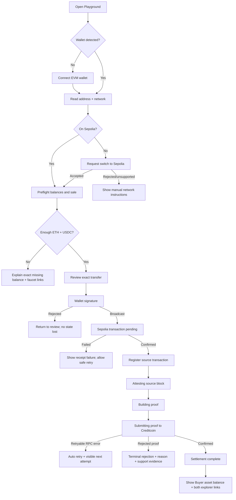

# SettleRWA UI/UX Blueprint

**Direction:** Protocol Workbench  
**Audience:** protocol engineers, marketplace builders, RWA issuers, technical evaluators  
**Visual system:** Shadcn New York, Zinc neutral base, verification green accent  
**Primary promise:** payment stays on Ethereum, ownership settles on Creditcoin, only proof crosses chains

## 1. Product and design principles

1. **Show the mechanism, not Web3 theater.** Every state names the actual system action.
2. **One decision per viewport.** Landing explains; Playground executes; transaction detail proves.
3. **Chain context is always visible.** Source and settlement networks never rely on color alone.
4. **Waiting is a product state.** Attestation can take minutes, so the UI explains progress, persistence, and safe recovery.
5. **Evidence is the success screen.** A successful result includes explorer links, query ID, block, asset balance, and replay status.
6. **No “Bridging” label.** No asset or payment is bridged. Use `Attesting source transaction` or `Building inclusion proof`.

## 2. Design system

### Foundation

| Token | Recommendation |
|---|---|
| Background | `zinc-950` dark default; `zinc-50` optional light documentation surface |
| Surface | `zinc-900/70`, subtle 1px `zinc-800` border |
| Primary text | `zinc-50` |
| Secondary text | `zinc-400` |
| Verification | emerald/lime restrained to verified states and primary execution CTA |
| Warning | amber only for user-actionable delays |
| Destructive | red only for terminal rejection or unsafe network |
| Radius | New York: 6–8px; avoid oversized pill cards |
| Grid | 12 columns desktop, 6 tablet, 4 mobile; max width 1200–1280px |
| Body typography | Geist Sans or Geist; technical values use Geist Mono |
| Motion | 160–220ms interaction; long-running state uses slow, non-blocking pulse |

The memorable visual is a thin proof ray travelling from the Sepolia receipt panel to the Creditcoin escrow panel. It is decorative in the Hero and becomes a deterministic progress rail in the Playground.

### Registry and setup contract

The official site currently demonstrates Shadcn registry installation with:

```bash
npx shadcn@latest init
npx shadcn@latest add @vengeanceui/animated-rays
```

Recommended `components.json` registry entry:

```json
{
  "style": "new-york",
  "registries": {
    "@vengeanceui": "https://www.vengenceui.com/r/{name}.json"
  }
}
```

Important: the brand/alias is spelled `vengeanceui`, while the published domain is currently `vengenceui.com`. Preview every registry change before applying it:

```bash
npx shadcn@latest add @vengeanceui/animated-rays --dry-run
```

The requested `npx vengeanceui init -y` command was not confirmed in the published documentation during research. Treat it as optional until `npx vengeanceui --help` succeeds; Shadcn registry installation is the reliable path. MCP configuration is development tooling and must not become a production dependency.

## 3. Sitemap

```text
/
├── Topbar
├── Hero
├── Mechanism / How proof-triggered DvP works
├── Core guarantees
├── Live evidence
├── INFRA.MD preview
├── Terms & transparency
└── Final CTA

/playground
├── Connection header
├── Sale workspace
│   ├── Source: Sepolia payment
│   ├── Proof rail: Attestcoin lifecycle
│   └── Destination: Creditcoin escrow
├── Event timeline / console
└── Result evidence

/infra
└── Rendered INFRA.MD with sticky table of contents

/tx/[saleId]
└── Recoverable, shareable settlement status and explorer evidence
```

`/tx/[saleId]` is important: it lets a user close the tab during attestation and return without restarting or resending payment.

## 4. Landing page blueprint

```text
┌─────────────────────────────────────────────────────────────────────┐
│ SettleRWA  Product  Infrastructure  Evidence  [Open Playground]    │
├─────────────────────────────────────────────────────────────────────┤
│ Badge: PROOF-TRIGGERED SETTLEMENT / CC3 TESTNET                     │
│                                                                     │
│ Settle RWA ownership                                                │
│ against verified payment.                  Animated proof rays      │
│ Without moving the payment.                Sepolia → Proof → CC3    │
│                                                                     │
│ [Read INFRA.MD] [Try Playground]   Live: v3 · verified settlement   │
├─────────────────────────────────────────────────────────────────────┤
│ PAYMENT STAYS       ONLY PROOF CROSSES       ASSET SETTLES          │
│ Sepolia receipt  →  Attestcoin inclusion  →  Creditcoin escrow     │
├─────────────────────────────────────────────────────────────────────┤
│ Core guarantees: 3–4 restrained technical cards                    │
├─────────────────────────────────────────────────────────────────────┤
│ Live evidence: transaction hashes, latency, query ID, replay mark   │
├─────────────────────────────────────────────────────────────────────┤
│ INFRA.MD preview: sticky file tree | rendered excerpt | copy link   │
├─────────────────────────────────────────────────────────────────────┤
│ Terms: Testnet, curated asset allowlist, 24h+ reclaim, 8–10m proof  │
├─────────────────────────────────────────────────────────────────────┤
│ Build on the settlement primitive. [Read INFRA.MD] [Open Console]  │
└─────────────────────────────────────────────────────────────────────┘
```

### Section narrative

1. **Hero — What it does.** A single sentence and visual source→proof→destination model.
2. **Mechanism — How it works.** Three exact steps, with no marketing abstractions.
3. **Guarantees — Why trust it.** Exact-match receipt validation, escrow custody, one-use query ID, permissionless proof submission.
4. **Evidence — Prove it works.** Use the active v3 public transactions and 489-second observed latency.
5. **INFRA.MD — Let builders integrate.** Manifest, stable ABI, parameter rules, lifecycle, events, recovery.
6. **Terms — State limitations.** Testnet only, curated asset onboarding, no immediate cancellation, attestation latency.

## 5. Component mapping

| Section | Vengeance UI | Shadcn/New York | Notes |
|---|---|---|---|
| Topbar | `spotlight-navbar` or restrained `notch-navbar` | Button, DropdownMenu | No glass dock on mobile; maintain documentation-tool tone |
| Hero | `animated-rays` | Badge, Button | Rays visualize proof only; disable or simplify for reduced motion |
| Mechanism | `agent-bento-grid` or static bento composition | Card, Separator | Cards should read as system modules, not feature marketing |
| Guarantees | `glow-border-card` used only on verified state | Tooltip, Badge | One glow maximum in viewport |
| Evidence | `animated-number` for observed latency | Table, Card, CopyButton, Tooltip | Explorer links are first-class actions |
| INFRA.MD | `folder-preview` | Tabs, ScrollArea, CodeBlock, Breadcrumb | Actual file content, never fake terminal text |
| Terms | `faq-accordion` | Accordion, Alert | Plain language; default first limitation open |
| Playground load | `kinetic-text-loader` | Skeleton, Progress | Use only during initial hydration; not for 8-minute wait |
| Playground shell | none; keep functional | Resizable panels, Card, Tabs, Sheet | Desktop: 3-pane; mobile: vertical stepper |
| Wallet selection | none | Dialog, Button, Alert | Wallet logo + address + detected network |
| Execution | `animated-button` sparingly | Button, AlertDialog | Signing buttons must remain visually stable |
| Notifications | none | Sonner | Toast supplements—not replaces—inline state |

Vengeance UI provides marketing motion; Shadcn owns transactional controls. Never place a high-motion component inside the wallet signing or error recovery surface.

## 6. Playground layout

### Desktop

```text
┌ Topbar: Playground | CC3 health | Sepolia health | 0x0954…33eD ┐
├─────────────────────────────────────────────────────────────────┤
│ Sale summary: 5 USDC ↔ Treasury Note #1001   Sale OPEN         │
├──────────────────┬──────────────────────┬───────────────────────┤
│ 1 / SOURCE       │ 2 / PROOF            │ 3 / SETTLEMENT        │
│ Sepolia          │ Attestcoin           │ Creditcoin CC3        │
│                  │                      │                       │
│ Buyer / balance  │ Finality progress    │ Escrow asset          │
│ Recipient        │ Query ID             │ Expected recipient    │
│ Exact amount     │ Attested height      │ Sale status           │
│                  │                      │                       │
│ [Pay 5 USDC]     │ passive status       │ passive status        │
├──────────────────┴──────────────────────┴───────────────────────┤
│ Event timeline / technical console                  [Details ▾]│
└─────────────────────────────────────────────────────────────────┘
```

### Mobile

- Sticky compact sale summary.
- Vertical stepper: Pay → Attest → Verify → Settle.
- Only the active step is expanded.
- Explorer links open in a bottom sheet before leaving the app.
- Primary CTA remains above the safe-area inset; never cover wallet UI.

## 7. User flow



## 8. UI state machine

| UI state | Trigger | Primary UI | User action |
|---|---|---|---|
| `DISCONNECTED` | no wallet account | connect card | Connect wallet |
| `WRONG_NETWORK` | chain ≠ Sepolia for payment | inline warning | Switch to Sepolia |
| `PREFLIGHT` | account/network ready | skeleton → balance checks | none |
| `INSUFFICIENT_GAS` | ETH below estimated cost | exact deficit alert | Open faucet / retry |
| `INSUFFICIENT_USDC` | USDC below exact amount | exact deficit alert | Open faucet / retry |
| `READY_TO_PAY` | all checks pass | transfer review | Pay exact amount |
| `AWAITING_SIGNATURE` | transfer requested | stable modal | Confirm in wallet |
| `SOURCE_PENDING` | hash broadcast, no receipt | Sepolia pulse + hash | View transaction |
| `SOURCE_CONFIRMED` | successful receipt | source pane checked | none |
| `WAITING_ATTESTATION` | source block above attested height | block progress | Safe to leave |
| `GENERATING_PROOF` | height attested | deterministic loader | none |
| `PROOF_READY` | proof generated | proof summary | none |
| `SUBMITTING` | CC3 transaction sent | CC3 pulse + hash | View transaction |
| `SETTLED` | CC3 receipt + on-chain reconciliation | evidence panel | View asset / copy IDs |
| `RETRYABLE_ERROR` | RPC 429/timeout/server error | amber alert + countdown | Retry now |
| `PERMANENT_REJECTION` | mismatched receipt/proof | red evidence panel | Copy diagnostic |

### Recovery rules

- Persist `{saleId, sourceTxHash}` in the URL/server state immediately after payment confirmation.
- Reloading must query `/api/v1/sales/:saleId/settlement`; it must not prompt payment again.
- Disable “Pay” permanently once a source transaction is registered for that sale.
- RPC timeout copy must distinguish “status unavailable” from “transaction failed.”
- Network-switch failure never blocks manual switching; show chain ID, RPC, and “I switched—check again.”

## 9. Copywriting deck

### Landing hero

- Eyebrow: `PROOF-TRIGGERED RWA SETTLEMENT`
- Headline: `Settle ownership against verified payment.`
- Accent line: `Without moving the payment.`
- Subheadline: `USDC stays on Ethereum. The RWA stays on Creditcoin. Attestcoin proves the payment, and the escrow contract releases the asset.`
- Primary CTA: `Try Playground`
- Secondary CTA: `Read INFRA.MD`
- Trust strip: `No bridge · No wrapped USDC · No trusted settlement worker`

### Mechanism

- Step 1 title: `Pay on the source chain`
- Step 1 body: `The Buyer transfers the exact USDC amount on Sepolia.`
- Step 2 title: `Prove the receipt`
- Step 2 body: `Attestcoin verifies inclusion, continuity, receipt success, and the exact Transfer log.`
- Step 3 title: `Release from escrow`
- Step 3 body: `Creditcoin releases the RWA only when the verified payment matches the sale.`

### Wallet and preflight

- Connect: `Connect EVM wallet`
- Connecting: `Waiting for wallet…`
- Switch: `Switch to Sepolia`
- Manual switch: `Open wallet and select Sepolia Testnet, then check again.`
- Wrong account: `This sale is reserved for {shortAddress}. Switch to the designated Buyer wallet.`
- Gas tooltip: `Sepolia ETH pays network fees only. It is not part of the sale amount.`
- USDC tooltip: `The contract accepts the official Sepolia USDC token at this address.`

### Payment review modal

- Title: `Review source-chain payment`
- Body: `You will send exactly {amount} USDC on Sepolia to {recipient}. The payment stays on Sepolia and cannot be reversed by SettleRWA.`
- Rows: `From`, `Recipient`, `Token`, `Amount`, `Network`, `Eligible block window`
- Confirm: `Pay {amount} USDC`
- Cancel: `Not now`
- Safety note: `Never send from a different wallet or token contract. The proof must match every field exactly.`

### Processing

- Source pending: `Payment submitted`
- Source helper: `Waiting for a successful Sepolia receipt.`
- Attesting: `Attesting source transaction`
- Attesting helper: `Latest attested block: {latest} · Payment block: {target}`
- Safe leave: `You can close this page. Settlement will continue automatically.`
- Proof: `Building inclusion proof`
- Submitting: `Submitting verified proof to Creditcoin`
- Settlement helper: `The worker submits data; the contract independently decides.`

### Success

- Title: `Ownership settled`
- Body: `Payment is final on Sepolia and RWA #{tokenId} is now owned by {buyer} on Creditcoin.`
- CTA 1: `View Sepolia payment`
- CTA 2: `View Creditcoin settlement`
- CTA 3: `Copy proof details`
- Fact labels: `Query ID`, `Source block`, `Settlement transaction`, `Replay protected`, `Escrow balance`

### Errors

- Wallet rejected: `Signature request was declined. No transaction was sent.`
- Switch rejected: `Network switch was not approved. Switch manually, then check again.`
- RPC timeout: `We cannot read the network right now. Your transaction may still be processing.`
- Source reverted: `The Sepolia payment failed. No proof will be submitted.`
- Wrong payment: `The payment receipt does not match this sale.`
- Attestation slow: `Attestation is taking longer than usual. Your confirmed payment is recorded; no action is required.`
- Retry CTA: `Check status again`
- Diagnostic CTA: `Copy diagnostic`

### Terms and transparency

- Heading: `Know exactly what the primitive does.`
- Testnet: `This deployment runs on Sepolia and Creditcoin CC3 testnets. Assets and payments have no production guarantee.`
- Latency: `Settlement is not instant. Attestation typically takes 8–10 minutes on testnet.`
- Escrow: `The Seller cannot immediately cancel an open sale. Unpaid assets become reclaimable after the payment window plus a 24-hour proof grace period.`
- Allowlist: `Asset onboarding is curated in this version. Only approved ERC-1155 contracts can enter escrow.`
- Worker: `The worker discovers transactions and submits proofs. It cannot authorize an invalid settlement.`
- Atomicity: `This is proof-triggered delivery versus payment, not a simultaneous two-chain atomic swap.`

## 10. INFRA.MD content contract

`INFRA.MD` does not yet exist. Create it as the canonical builder entry point with:

1. Primitive in one paragraph.
2. Deployed addresses and explorer links from the manifest.
3. Trust model: `worker discovers, Attestcoin proves, contract decides`.
4. Five-step integration path.
5. `createSale` parameter table and unit rules.
6. Lifecycle and event table.
7. Retry/recovery behavior.
8. Protocol limits and explicit non-goals.
9. Copy-ready viem example.
10. Links to ABI, evidence, threat model, and full TDD.

The landing preview should render real sections 1–4 from this file at build time and link to `/infra`; do not maintain a second marketing-only version that can drift.

## 11. Accessibility and quality gates

- Minimum WCAG AA contrast; status never depends on color alone.
- Full keyboard flow for navigation, dialogs, accordions, and copy actions.
- `aria-live="polite"` for block progress; `assertive` only for terminal rejection.
- Honor `prefers-reduced-motion`; Animated Rays becomes a static source→proof→destination line.
- Do not repeatedly announce 15-second polling updates to screen readers.
- Mobile touch targets ≥ 44px.
- Explorer links name both network and action.
- Transaction hashes use monospace, middle truncation, full value in accessible label and copy action.

## 12. Recommended implementation sequence

1. Create and approve `INFRA.MD` content contract.
2. Add Tailwind/Shadcn New York and verify the Vengeance registry with `--dry-run`.
3. Build shared design tokens and primitives.
4. Build Landing as server components; isolate Animated Rays as a small client island.
5. Build `/playground` shell and state machine against the existing v1 API.
6. Add wallet adapter and network switching.
7. Add `/tx/[saleId]` recovery route.
8. Test all success/error states with deterministic fixtures before enabling live transactions.
9. Run accessibility, responsive, bundle, and Vercel production checks.

## Research references

- [Vengeance UI component catalog](https://www.vengenceui.com/components)
- [Vengeance UI Next.js installation](https://www.vengenceui.com/docs/install-nextjs)
- [Shadcn registry CLI guidance](https://github.com/shadcn-ui/ui/blob/main/skills/shadcn/cli.md)
